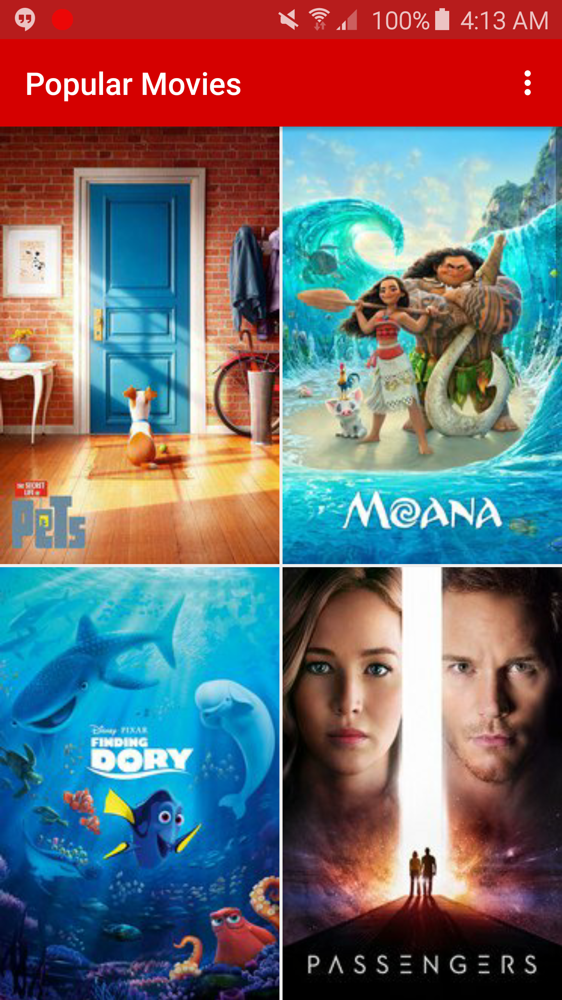

#About The Project
This project is part of **Udacity Android Nanodegree** program. This project provides the user a
main screen with movie posters in a grid layout. The user can click on any of the poster and
this will take him/her to the a different screen containing details about the movie. Further
user has the option to select between two sorting orders popular/top rated using the settings
menu option. Depending upo the sorting choice the main screen will get updated.

#How to get API key
This project fetches movies information from [The Movie Database API](https://www.themoviedb.org/). This requires a key. In order to use the project make an account on The Movie Database. After that login to the account and goto the Account section API on the left side. Here you can find the API key under the option API.
Copy the key and add this key to the build.gradle file (for the app).

it.buildConfigField 'String', 'OPEN\_MOVIE\_API\_KEY', "\"add key here\""
